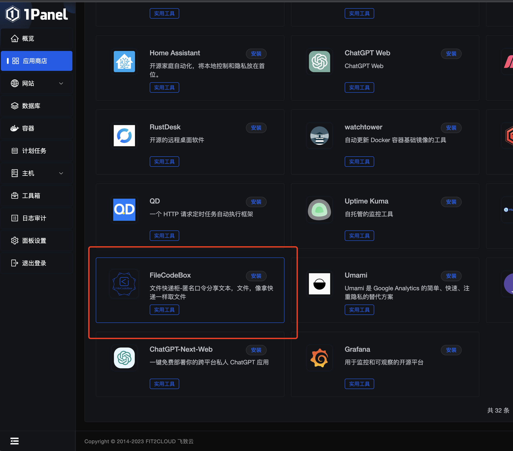

<div align="center">
<h1>FileCodeBox-Lite</h1>
<h2>FileCodeBox-Lite</h2>
<p><em>Share texts and files anonymously with passwords, just like picking up a package</em></p>
<p>Join our QQ group: 739673698</p>
</div>


---

[Simplified Chinese](./readme.md) | [English](./readme_en.md)

## Main Features

- [x] **Lightweight:** Built with FastAPI + Sqlite3 + Vue2 + ElementUI
- [x] **Easy Upload:** Support copy-paste and drag-and-drop selection
- [x] **Various Types:** Supports text and file sharing
- [x] **Brute-force Protection:** Error limit on passwords
- [x] **Abuse Prevention:** IP limits on upload attempts
- [x] **Password Sharing:** Random password for accessing files, customizable access counts, and expiration
- [x] **Internationalization:** Supports both Chinese and English
- [x] **Anonymous Sharing:** No need for registration or login
- [x] **Management Panel:** View and delete files
- [x] **One-Click Deployment:** Support for Docker deployment
- [x] **Free Extension:** Supports S3 protocol and local file stream; can add new storage engines in storage file as needed
- [x] **Simple and Clear:** Great for beginners
- [x] **Terminal Download:** Terminal command `wget https://share.lanol.cn/share/select?code=83432`

## Deployment Methods

### 1Panel One-Click Deployment

Go to Application Store -> Utilities -> FileCodeBox

**Update:** Container -> Select -> More -> Edit -> Force Pull Image -> Confirm

### One-Click Deployment in BaoTa Application Store

Current version is 1.6


### Docker One-Click Deployment

**Version 2.0**, work in progress

Default Info

Backend Address: `/#/admin`

Admin Password: `FileCodeBox2023`

*Supports AMD & ARM*

**One-Click Install**

```bash
docker run -d --restart=always -p 12345:12345 -v /opt/FileCodeBox/:/app/data --name filecodebox lanol/filecodebox:beta
```

**One-Click Update**

```bash
docker pull lanol/filecodebox:beta && docker stop filecodebox && docker rm filecodebox && docker run -d --restart=always -p 12345:12345 -v /opt/FileCodeBox/:/app/data --name filecodebox lanol/filecodebox:beta
```

**Version 1.6 AMD**

```bash
docker run -d --restart=always -p 12345:12345 -v /opt/FileCodeBox/:/app/data --name filecodebox lanol/filecodebox:latest
```

**Version 1.6 ARM**

```bash
docker run -d --restart=always -p 12345:12345 -v /opt/FileCodeBox/:/app/data --name filecodebox lanol/filecodebox:arm
```

### Update Methods

```bash
// Update the container
docker pull lanol/filecodebox:beta
// Stop and remove the container
docker stop filecodebox && docker rm filecodebox
// Re-run the container
docker run -d --restart=always -p 12345:12345 -v /opt/FileCodeBox/:/app/data --name filecodebox lanol/filecodebox:latest
```

### Notes on Version 1.6

This version has significant changes. If issues occur, try clearing the /opt/FileCodeBox directory. Feel free to provide feedback. **Note:** For first-time installations, check Docker logs for the initial password and backend address, as shown below:

```bash
docker logs filecodebox
```

**Backend Local File List**: Move server files to the /opt/FileCodeBox/data/locals directory for display.

## Preview

### Example Site

[https://share.lanol.cn](https://share.lanol.cn)

### Screenshots

<table style="width:100%">
<tr style="width: 100%">
<td style="width: 50%"></td>
<td style="width: 50%"></td>
</tr>
<tr style="width: 100%">
<td style="width: 50%"></td>
<td style="width: 50%"></td>
</tr>
<tr style="width: 100%">
<td style="width: 50%"></td>
<td style="width: 50%"></td>
</tr>
</table>

## Configuration File (for versions 1.7 and below)

To modify the configuration, save the following content as a `.env` file in the `/opt/FileCodeBox/` directory, then restart the container. If not using Docker, create a `data` folder in the project directory and place the `.env` file inside.

```dotenv
# Port
PORT=12345
# Sqlite database file
DATABASE_URL=sqlite+aiosqlite:///database.db
# Static folder
DATA_ROOT=./static
# Static folder URL
STATIC_URL=/static
# Enable uploads
ENABLE_UPLOAD=True
# Error limit
ERROR_COUNT=5
# Error limit in minutes
ERROR_MINUTE=10
# Upload limit
UPLOAD_COUNT=60
# Upload limit in minutes
UPLOAD_MINUTE=1
# Interval for deleting expired files (in minutes)
DELETE_EXPIRE_FILES_INTERVAL=10
# Admin address
ADMIN_ADDRESS=admin
# Admin password
ADMIN_PASSWORD=admin
# File size limit, default 10MB
FILE_SIZE_LIMIT=10
# Website title
TITLE=FileCodeBox
# Website description
DESCRIPTION=FileCodeBox, file delivery cabinet, password transfer box, anonymous password sharing of text, files, images, videos, audio, compressed files, and other types of files
# Website keywords
KEYWORDS=FileCodeBox, file delivery cabinet, password transfer box, anonymous password sharing of text, files, images, videos, audio, compressed files, and other types of files
# Storage engine
STORAGE_ENGINE=filesystem
# If using Alibaba Cloud OSS service, create these additional parameters:
# Alibaba Cloud Account AccessKey
KeyId=Alibaba Cloud Account AccessKey
# Alibaba Cloud Account AccessKeySecret
KeySecret=Alibaba Cloud Account AccessKeySecret
# Alibaba Cloud OSS Bucket region node
OSS_ENDPOINT=Alibaba Cloud OSS Bucket region node
# Alibaba Cloud OSS Bucket name
BUCKET_NAME=Alibaba Cloud OSS Bucket name
```

## Status


## Star History

[](https://star-history.com/#vastsa/FileCodeBox&Date)

## Frequently Asked Questions (FAQ)

1. *413 Request Entity Too Large*:  
   Nginx limit resolution:
   Open your host's `nginx.conf` configuration file, locate it,
   Add `client_max_body_size 10m;` within the `http{}` block,
   Then restart Nginx.

## Disclaimer

This project is open-source and intended for learning purposes only. Do not use it for any illegal activities; any consequences are your own responsibility and unrelated to the author. Please retain the project address when using, thank you.